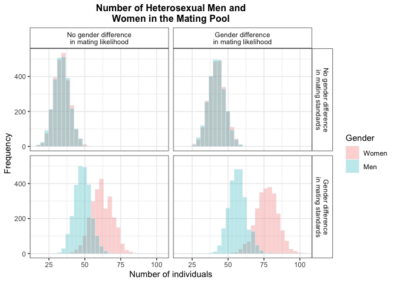
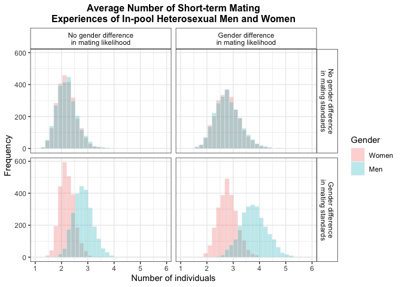
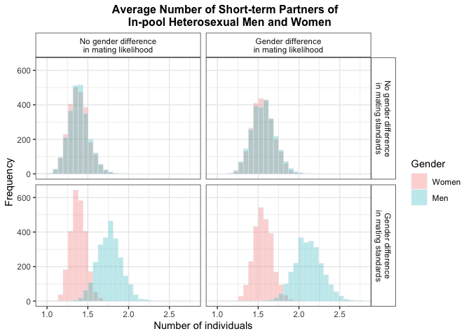

20220416_descriptives
================
Yurun (Ellen) Ying
4/16/2022

## Overview

### Experiments

-   Experiment 1: Experiment of heterosexual individuals
    `homosexual = 0`
-   Experiment 2: Experiment of gay men and lesbian women
    `homosexual = 1`

### Conditions

|                                              | Likelihood - Difference `diff_likelihood = 1`                                             | No difference `diff_likelihood = 0`                                                       |
|----------------------------------------------|----------------------------------------------------------------------------------------------|----------------------------------------------------------------------------------------------|
| Standard - Difference `diff_standard = 1` | male-likelihood = 40% female-likelihood = 25% male-standard = 3 female-standard = 5 | male-likelihood = 25% female-likelihood = 25% male-standard = 3 female-standard = 5 |
| No difference `diff_standard = 0`         | male-likelihood = 40% female-likelihood = 25% male-standard = 5 female-standard = 5 | male-likelihood = 25% female-likelihood = 25% male-standard = 5 female-standard = 5 |

### Outcome variables

-   number of men and women who were in the mating pool `m_inpool`
    `f_inpool`
-   number of men and women who were out of the mating pool `m_outpool`
    `f_outpool`
-   average number of short-term mating experiences of total populations
    of men and women `m_exp_all` `f_exp_all`
-   average number of short-term mating experiences of men and women in
    the pool `m_exp_ip` `f_exp_ip`
-   average number of short-term partners of total populations of men
    and women `m_partner_all` `f_partner_all`
-   average number of short-term partners of men and women in the pool
    `m_partner_ip` `f_partner_ip`

## Experiment 1: Experiment of heterosexual individuals

### Means of the outcome variables

| diff_likelihood | diff_standard | m_inpool | f_inpool | m_outpool | f_outpool | m_exp_all | f_exp_all | m_exp_ip | f_exp_ip | m_partner_all | f_partner_all | m_partner_ip | f_partner_ip |
|----------------:|--------------:|---------:|---------:|----------:|----------:|----------:|----------:|---------:|---------:|--------------:|--------------:|-------------:|-------------:|
|               0 |             0 |  33.7200 |  33.8296 |  116.2800 |  116.1704 | 0.4962667 | 0.4962667 | 2.207255 | 2.197034 |     0.3131147 |     0.3131147 |     1.390618 |     1.385466 |
|               0 |             1 |  48.5496 |  61.8524 |  101.4504 |   88.1476 | 0.9115040 | 0.9115040 | 2.815906 | 2.208781 |     0.5711387 |     0.5711387 |     1.764784 |     1.383136 |
|               1 |             0 |  42.0424 |  42.2284 |  107.9576 |  107.7716 | 0.7844027 | 0.7844027 | 2.796560 | 2.782800 |     0.4395600 |     0.4395600 |     1.565658 |     1.558614 |
|               1 |             1 |  56.8548 |  77.0372 |   93.1452 |   72.9628 | 1.4328960 | 1.4328960 | 3.778855 | 2.785322 |     0.8029573 |     0.8029573 |     2.117703 |     1.560579 |

-   **Number of men and women in/out of the mating pool**
    -   When there was a gender difference in short-term mating
        standards, there were more women than men in the mating pool,
        and more men than women out of the mating pool.
    -   This gender difference existed no matter whether there was a
        gender difference in the likelihood of short-term mating.
    -   This gender difference disappeared when there was no gender
        difference in short-term mating standards.
-   **Average number of short-term mating experiences of all/in-pool men
    and women**
    -   No gender differences in the average number for all men and
        women
    -   When there was a gender difference in short-term mating
        standards, in-pool men had a higher average number of short-term
        mating experiences than in-pool women. This was true no matter
        whether there was a gender difference in the likelihood of
        short-term mating.
    -   This gender difference disappeared when there was no gender
        difference in short-term mating standards.
-   **Average number of short-term partners of all/in-pool men and
    women**
    -   No gender differences in the average number for all men and
        women
    -   When there was a gender difference in short-term mating
        standards, in-pool men had a higher average number of short-term
        mates than in-pool women. This was true no matter whether there
        was a gender difference in the likelihood of short-term mating.
    -   This gender difference disappeared when there was no gender
        difference in short-term mating standards.

### Distributions of the outcome variables

-   Number of men and women in the mating pool
    

-   Average number of short-term mating experiences of men and women in
    the mating pool
    

-   Average number of short-term partners of men and women in the mating
    pool
    

## Experiment 2: Experiment of gay men and lesbian women

### Means of the outcome variables

| diff_likelihood | diff_standard | m_inpool | f_inpool | m_outpool | f_outpool | m_exp_all | f_exp_all | m_exp_ip | f_exp_ip | m_partner_all | f_partner_all | m_partner_ip | f_partner_ip |
|----------------:|--------------:|---------:|---------:|----------:|----------:|----------:|----------:|---------:|---------:|--------------:|--------------:|-------------:|-------------:|
|               0 |             0 |  28.7880 |  28.9676 |  121.2120 |  121.0324 | 0.3167040 | 0.3203840 | 1.637235 | 1.645982 |     0.2474187 |     0.2498987 |     1.278045 |     1.283332 |
|               0 |             1 |  79.3104 |  28.8208 |   70.6896 |  121.1792 | 1.0493760 | 0.3152107 | 1.978986 | 1.626778 |     0.8200693 |     0.2471147 |     1.546804 |     1.275365 |
|               1 |             0 |  47.2628 |  29.0532 |  102.7372 |  120.9468 | 0.7960213 | 0.3202560 | 2.504022 | 1.640773 |     0.5189813 |     0.2500960 |     1.632979 |     1.280185 |
|               1 |             1 | 113.2056 |  28.8488 |   36.7944 |  121.1512 | 2.6281867 | 0.3169280 | 3.476271 | 1.636481 |     1.7188693 |     0.2479787 |     2.273679 |     1.278857 |
