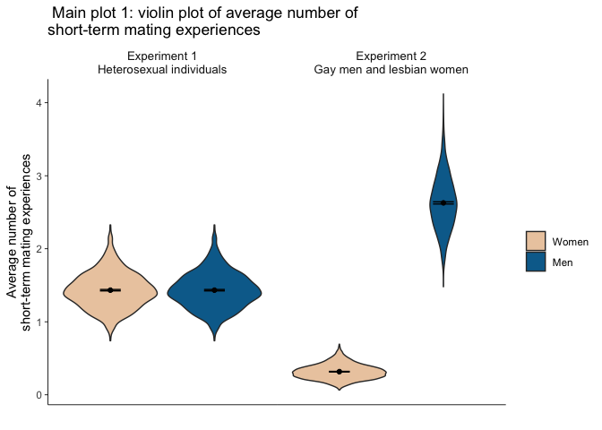
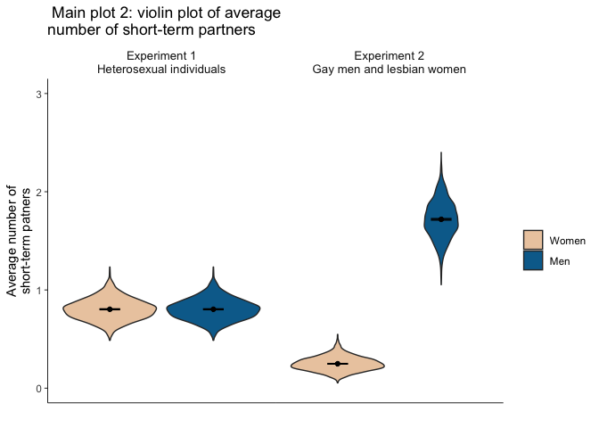

20220426_main_plot_t\_test
================
Yurun (Ellen) Ying
4/26/2022

## Main plots

-   Violin plots of the diff x diff condition
    -   grouped by gender
    -   paneled by experiments
    -   separate for two dependent variables: avg num of experiences
        (all), avg num of partners (all)

``` r
casual_tib %>% 
  filter(diff_likelihood == 1, diff_standard == 1) %>% 
  select(homosexual, m_exp_all, f_exp_all) %>% 
  pivot_longer(c(m_exp_all, f_exp_all), values_to = "exp_all",
               names_to = "gender", names_pattern = "(.)_exp_all") %>% 
  ggplot(aes(x = gender, y = exp_all)) +
  geom_violin(aes(fill = gender)) +
  stat_summary(fun = "mean", geom = "point") +
  stat_summary(fun.data = mean_cl_normal, geom = "errorbar", width = 0.2) +
  scale_fill_discrete(
    type = wes_palette("Darjeeling2", 2, type = "discrete"),
    name = "", labels = c("Women", "Men")
  ) +
  labs(x = "", y = "Average number of\nshort-term mating experiences",
       title = " Main plot 1: violin plot of average number of\nshort-term mating experiences") +
  facet_wrap(
    ~ homosexual,
    labeller = labeller(
      homosexual = c(
        `0` = "Experiment 1\nHeterosexual individuals",
        `1` = "Experiment 2\nGay men and lesbian women")
      )) +
  theme_minimal() +
  theme(
    axis.line = element_line(size = 0.3),
    axis.ticks.y = element_line(size = 0.3),
    axis.text.x = element_blank(),
    panel.grid = element_blank(),
    panel.spacing = unit(0, "npc"),
    strip.text = element_text(size = 10)
    )
```

<!-- -->

``` r
casual_tib %>% 
  filter(diff_likelihood == 1, diff_standard == 1) %>% 
  select(homosexual, m_partner_all, f_partner_all) %>% 
  pivot_longer(c(m_partner_all, f_partner_all), values_to = "partner_all",
               names_to = "gender", names_pattern = "(.)_partner_all") %>% 
  ggplot(aes(x = gender, y = partner_all)) +
  geom_violin(aes(fill = gender)) +
  stat_summary(fun = "mean", geom = "point") +
  stat_summary(fun.data = mean_cl_normal, geom = "errorbar", width = 0.2) +
  coord_cartesian(ylim = c(0, 3)) +
  scale_fill_discrete(
    type = wes_palette("Darjeeling2", 2, type = "discrete"),
    name = "", labels = c("Women", "Men")
  ) +
  labs(x = "", y = "Average number of\nshort-term patners",
       title = " Main plot 2: violin plot of average\nnumber of short-term partners") +
  facet_wrap(
    ~ homosexual,
    labeller = labeller(
      homosexual = c(
        `0` = "Experiment 1\nHeterosexual individuals",
        `1` = "Experiment 2\nGay men and lesbian women")
      )) +
  theme_minimal() +
  theme(
    axis.line = element_line(size = 0.3),
    axis.ticks.y = element_line(size = 0.3),
    axis.text.x = element_blank(),
    panel.grid = element_blank(),
    panel.spacing = unit(0, "npc"),
    strip.text = element_text(size = 10)
    )
```

<!-- -->

## T-tests

-   Independent samples *t*-test between men and women, separate for
    conditions and experiments
-   Output into tables with descriptives and test results, separate by
    variables

``` r
# create a long tibble
casual_long <- 
  casual_tib %>%
  unite(homosexual, diff_likelihood, diff_standard,
        col = "homosexual_dlikelihood_dstandard", sep = "_") %>% 
  pivot_longer(-c(seed, homosexual_dlikelihood_dstandard), 
               names_to = c("gender", ".value"), 
               names_pattern = "(.)_(.*)"
  )

# descriptives
casual_des <- 
  casual_long %>% 
  group_by(homosexual_dlikelihood_dstandard, gender) %>% 
  summarise(across(inpool:partner_ip, 
                   list(mean = mean, sd = sd),
                   .names = "{.col}.{.fn}")) %>% 
  pivot_wider(names_from = gender, 
              values_from = -c(homosexual_dlikelihood_dstandard, gender),
              names_glue = "{gender}_{.value}")
```

    ## `summarise()` has grouped output by 'homosexual_dlikelihood_dstandard'. You can
    ## override using the `.groups` argument.

``` r
# t test by groups for exp_all variable
casual_t_test <- 
  casual_long %>% 
  nest_by(homosexual_dlikelihood_dstandard) %>% 
  mutate(
    inpool = t.test(inpool ~ gender, data = data) %>% tidy() %>% 
      select(statistic, p.value, parameter),
    outpool = t.test(outpool ~ gender, data = data) %>% tidy() %>% 
      select(statistic, p.value, parameter),
    exp_all = t.test(exp_all ~ gender, data = data) %>% tidy() %>% 
      # somehow the map function doesn't work here and I wonder why...
      select(statistic, p.value, parameter),
    exp_ip = t.test(exp_ip ~ gender, data = data) %>% tidy() %>% 
      select(statistic, p.value, parameter),
    partner_all = t.test(partner_all ~ gender, data = data) %>% tidy() %>% 
      select(statistic, p.value, parameter),
    partner_ip = t.test(partner_ip ~ gender, data = data) %>% tidy() %>% 
      select(statistic, p.value, parameter)
    ) %>% 
  select(-data) %>% 
  unnest(cols = -homosexual_dlikelihood_dstandard, names_sep = ".")

# effect size
casual_d <- 
  casual_long %>% 
  nest_by(homosexual_dlikelihood_dstandard) %>% 
  mutate(
    inpool.d = cohens_d(inpool ~ gender, data = data) %>% pull(Cohens_d),
    outpool.d = cohens_d(outpool ~ gender, data = data) %>% pull(Cohens_d),
    exp_all.d = cohens_d(exp_all ~ gender, data = data) %>% pull(Cohens_d),
    exp_ip.d = cohens_d(exp_ip ~ gender, data = data) %>% pull(Cohens_d),
    partner_all.d = cohens_d(partner_all ~ gender, data = data) %>% pull(Cohens_d),
    partner_ip.d = cohens_d(partner_ip ~ gender, data = data) %>% pull(Cohens_d)
    )

# combine the descriptives, test results, and effect size
full_join(casual_des, casual_t_test, casual_d, by = "homosexual_dlikelihood_dstandard") %>% 
  kable()
```

| homosexual_dlikelihood_dstandard | f_inpool.mean | m_inpool.mean | f_inpool.sd | m_inpool.sd | f_outpool.mean | m_outpool.mean | f_outpool.sd | m_outpool.sd | f_exp_all.mean | m_exp_all.mean | f_exp_all.sd | m_exp_all.sd | f_exp_ip.mean | m_exp_ip.mean | f_exp_ip.sd | m_exp_ip.sd | f_partner_all.mean | m_partner_all.mean | f_partner_all.sd | m_partner_all.sd | f_partner_ip.mean | m_partner_ip.mean | f_partner_ip.sd | m_partner_ip.sd | inpool.statistic | inpool.p.value | inpool.parameter | outpool.statistic | outpool.p.value | outpool.parameter | exp_all.statistic | exp_all.p.value | exp_all.parameter | exp_ip.statistic | exp_ip.p.value | exp_ip.parameter | partner_all.statistic | partner_all.p.value | partner_all.parameter | partner_ip.statistic | partner_ip.p.value | partner_ip.parameter |
|:---------------------------------|--------------:|--------------:|------------:|------------:|---------------:|---------------:|-------------:|-------------:|---------------:|---------------:|-------------:|-------------:|--------------:|--------------:|------------:|------------:|-------------------:|-------------------:|-----------------:|-----------------:|------------------:|------------------:|----------------:|----------------:|-----------------:|---------------:|-----------------:|------------------:|----------------:|------------------:|------------------:|----------------:|------------------:|-----------------:|---------------:|-----------------:|----------------------:|--------------------:|----------------------:|---------------------:|-------------------:|---------------------:|
| 0_0\_0                           |       33.8296 |       33.7200 |    5.548124 |    5.592970 |       116.1704 |       116.2800 |     5.548124 |     5.592970 |      0.4962667 |      0.4962667 |    0.1180591 |    0.1180591 |      2.197034 |      2.207255 |   0.3660900 |   0.3824203 |          0.3131147 |          0.3131147 |        0.0614255 |        0.0614255 |          1.385466 |          1.390618 |       0.1224168 |       0.1245132 |        0.6956074 |      0.4867071 |         4997.676 |        -0.6956074 |       0.4867071 |          4997.676 |          0.000000 |       1.0000000 |          4998.000 |       -0.9653458 |      0.3344184 |         4988.511 |              0.000000 |           1.0000000 |              4998.000 |            -1.475276 |          0.1402014 |             4996.560 |
| 0_0\_1                           |       61.8524 |       48.5496 |    7.104957 |    5.749014 |        88.1476 |       101.4504 |     7.104957 |     5.749014 |      0.9115040 |      0.9115040 |    0.1587309 |    0.1587309 |      2.208781 |      2.815906 |   0.2780305 |   0.3600298 |          0.5711387 |          0.5711387 |        0.0816486 |        0.0816486 |          1.383136 |          1.764784 |       0.0927250 |       0.1451402 |       72.7759281 |      0.0000000 |         4789.482 |       -72.7759281 |       0.0000000 |          4789.482 |          0.000000 |       1.0000000 |          4998.000 |      -66.7336456 |      0.0000000 |         4697.662 |              0.000000 |           1.0000000 |              4998.000 |          -110.795100 |          0.0000000 |             4247.630 |
| 0_1\_0                           |       42.2284 |       42.0424 |    5.951740 |    5.859278 |       107.7716 |       107.9576 |     5.951740 |     5.859278 |      0.7844027 |      0.7844027 |    0.1750587 |    0.1750587 |      2.782800 |      2.796560 |   0.4665798 |   0.4812486 |          0.4395600 |          0.4395600 |        0.0770521 |        0.0770521 |          1.558614 |          1.565658 |       0.1361085 |       0.1418986 |        1.1135183 |      0.2655395 |         4996.775 |        -1.1135183 |       0.2655395 |          4996.775 |          0.000000 |       1.0000000 |          4998.000 |       -1.0263639 |      0.3047698 |         4993.219 |              0.000000 |           1.0000000 |              4998.000 |            -1.791431 |          0.0732847 |             4989.351 |
| 0_1\_1                           |       77.0372 |       56.8548 |    7.534038 |    5.989262 |        72.9628 |        93.1452 |     7.534038 |     5.989262 |      1.4328960 |      1.4328960 |    0.2446285 |    0.2446285 |      2.785322 |      3.778855 |   0.3548921 |   0.4952783 |          0.8029573 |          0.8029573 |        0.1088504 |        0.1088504 |          1.560579 |          2.117703 |       0.1117483 |       0.1719169 |      104.8479591 |      0.0000000 |         4756.111 |      -104.8479591 |       0.0000000 |          4756.111 |          0.000000 |       1.0000000 |          4998.000 |      -81.5304136 |      0.0000000 |         4529.822 |              0.000000 |           1.0000000 |              4998.000 |          -135.854578 |          0.0000000 |             4290.857 |
| 1_0\_0                           |       28.9676 |       28.7880 |    6.942005 |    7.095181 |       121.0324 |       121.2120 |     6.942005 |     7.095181 |      0.3203840 |      0.3167040 |    0.1029041 |    0.1035050 |      1.645982 |      1.637235 |   0.2922699 |   0.2913901 |          0.2498987 |          0.2474187 |        0.0716867 |        0.0729659 |          1.283332 |          1.278045 |       0.1272052 |       0.1270302 |        0.9046601 |      0.3656891 |         4995.621 |        -0.9046601 |       0.3656891 |          4995.621 |          1.260672 |       0.2074859 |          4997.831 |        1.0597411 |      0.2893136 |         4997.955 |              1.212254 |           0.2254727 |              4996.437 |             1.470416 |          0.1415121 |             4997.991 |
| 1_0\_1                           |       28.8208 |       79.3104 |    6.999677 |    8.355236 |       121.1792 |        70.6896 |     6.999677 |     8.355236 |      0.3152107 |      1.0493760 |    0.1024196 |    0.1759911 |      1.626778 |      1.978986 |   0.2978122 |   0.2132485 |          0.2471147 |          0.8200693 |        0.0719928 |        0.1203031 |          1.275365 |          1.546804 |       0.1268487 |       0.1115161 |     -231.6080936 |      0.0000000 |         4849.158 |       231.6080936 |       0.0000000 |          4849.158 |       -180.274948 |       0.0000000 |          4017.526 |      -48.0779529 |      0.0000000 |         4528.167 |           -204.336012 |           0.0000000 |              4085.411 |           -80.355896 |          0.0000000 |             4917.287 |
| 1_1\_0                           |       29.0532 |       47.2628 |    7.137307 |    8.306849 |       120.9468 |       102.7372 |     7.137307 |     8.306849 |      0.3202560 |      0.7960213 |    0.1031848 |    0.2299144 |      1.640773 |      2.504022 |   0.2866779 |   0.4762827 |          0.2500960 |          0.5189813 |        0.0733687 |        0.1266930 |          1.280185 |          1.632979 |       0.1269182 |       0.1811387 |      -83.1341664 |      0.0000000 |         4887.171 |        83.1341664 |       0.0000000 |          4887.171 |        -94.395098 |       0.0000000 |          3466.441 |      -77.6437263 |      0.0000000 |         4099.642 |            -91.830047 |           0.0000000 |              4005.693 |           -79.753766 |          0.0000000 |             4476.166 |
| 1_1\_1                           |       28.8488 |      113.2056 |    6.940000 |    6.901129 |       121.1512 |        36.7944 |     6.940000 |     6.901129 |      0.3169280 |      2.6281867 |    0.1006094 |    0.3694800 |      1.636481 |      3.476271 |   0.2892771 |   0.3908389 |          0.2479787 |          1.7188693 |        0.0716732 |        0.1927126 |          1.278857 |          2.273679 |       0.1245237 |       0.1702069 |     -430.9549435 |      0.0000000 |         4997.842 |       430.9549435 |       0.0000000 |          4997.842 |       -301.783672 |       0.0000000 |          2867.562 |     -189.1826232 |      0.0000000 |         4604.970 |           -357.690744 |           0.0000000 |              3177.358 |          -235.857634 |          0.0000000 |             4578.417 |
