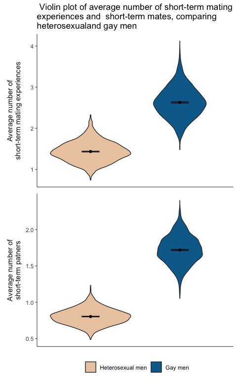

20220430_hetero_vs_gay
================
Yurun (Ellen) Ying
4/30/2022

## Plots

-   Violin plots of the diff x diff condition
    -   grouped by sexual orientation
    -   paneled by dependent variables: avg num of experiences (all),
        avg num of partners (all)

``` r
y_lab <- labeller(
      variable = c(
        `exp_all` = "Average number of\nshort-term mating experiences",
        `partner_all` = "Average number of\nshort-term patners"))

casual_tib %>% 
  filter(diff_likelihood == 1, diff_standard == 1) %>% 
  select(homosexual, m_exp_all, m_partner_all) %>% 
  pivot_longer(c(m_exp_all, m_partner_all), values_to = "value",
               names_to = "variable", names_pattern = "m_(.*)") %>% 
  ggplot(aes(x = homosexual, y = value)) +
  geom_violin(aes(fill = homosexual)) +
  stat_summary(fun = "mean", geom = "point") +
  stat_summary(fun.data = mean_cl_normal, geom = "errorbar", width = 0.2) +
  scale_fill_discrete(
    type = wes_palette("Darjeeling2", 2, type = "discrete"),
    name = "", labels = c("Heterosexual men", "Gay men")
  ) +
  labs(x = "", y = NULL,
       title = " Violin plot of average number of short-term mating\nexperiences and  short-term mates, comparing\nheterosexualand gay men") +
  facet_wrap(
    ~ variable, ncol = 1, scales = "free",
    strip.position = "left",
    labeller = y_lab
    ) +
  theme_minimal() +
  theme(
    axis.line = element_line(size = 0.3),
    axis.ticks.y = element_line(size = 0.3),
    axis.text.x = element_blank(),
    panel.grid = element_blank(),
    panel.spacing = unit(0.5, "line"),
    strip.text = element_text(size = 11),
    strip.placement = "outside",
    legend.position = "bottom",
    legend.box.spacing = unit(0.1, "line")
    )
```

<!-- -->

## T-tests

-   Independent samples *t*-test between heterosexual and gay men on all
    outcome variables, separate for conditions
-   Output into tables with descriptives and test results, separate by
    variables

``` r
# create a long tibble
casual_long <- 
  casual_tib %>%
  unite(diff_likelihood, diff_standard,
        col = "dlikelihood_dstandard", sep = "_") %>% 
  select(-c(seed, starts_with("f_")))

# descriptives
casual_des <- 
  casual_long %>% 
  group_by(dlikelihood_dstandard, homosexual) %>% 
  summarise(across(m_inpool:m_partner_ip, 
                   list(mean = mean, sd = sd),
                   .names = "{.fn}.{.col}"),
            .groups = "keep") %>% 
  pivot_wider(names_from = homosexual, 
              values_from = -c(dlikelihood_dstandard, homosexual),
              names_glue = "{.value}_{homosexual}")

# t test by groups for exp_all variable
casual_t_test <- 
  casual_long %>% 
  nest_by(dlikelihood_dstandard) %>% 
  mutate(
    m_inpool = t.test(m_inpool ~ homosexual, data = data) %>% tidy() %>% 
      select(statistic, p.value, parameter),
    m_outpool = t.test(m_outpool ~ homosexual, data = data) %>% tidy() %>% 
      select(statistic, p.value, parameter),
    m_exp_all = t.test(m_exp_all ~ homosexual, data = data) %>% tidy() %>% 
      # somehow the map function doesn't work here and I wonder why...
      select(statistic, p.value, parameter),
    m_exp_ip = t.test(m_exp_ip ~ homosexual, data = data) %>% tidy() %>% 
      select(statistic, p.value, parameter),
    m_partner_all = t.test(m_partner_all ~ homosexual, data = data) %>% tidy() %>% 
      select(statistic, p.value, parameter),
    m_partner_ip = t.test(m_partner_ip ~ homosexual, data = data) %>% tidy() %>% 
      select(statistic, p.value, parameter)
    ) %>% 
  select(-data) %>% 
  unnest(cols = -dlikelihood_dstandard, names_sep = ".")

# effect size
casual_d <- 
  casual_long %>% 
  nest_by(dlikelihood_dstandard) %>% 
  mutate(
    m_inpool.d = cohens_d(m_inpool ~ homosexual, data = data) %>% pull(Cohens_d),
    m_outpool.d = cohens_d(m_outpool ~ homosexual, data = data) %>% pull(Cohens_d),
    m_exp_all.d = cohens_d(m_exp_all ~ homosexual, data = data) %>% pull(Cohens_d),
    m_exp_ip.d = cohens_d(m_exp_ip ~ homosexual, data = data) %>% pull(Cohens_d),
    m_partner_all.d = cohens_d(m_partner_all ~ homosexual, data = data) %>% pull(Cohens_d),
    m_partner_ip.d = cohens_d(m_partner_ip ~ homosexual, data = data) %>% pull(Cohens_d)
    ) %>% 
  select(-data)

# combine the descriptives, test results, and effect size
des_t_d <- 
  full_join(casual_des, casual_t_test, by = "dlikelihood_dstandard") %>% 
  full_join(., casual_d, by = "dlikelihood_dstandard") 

# display the results 
des_t_d %>% kable()
```

| dlikelihood_dstandard | mean.m_inpool_0 | mean.m_inpool_1 | sd.m_inpool_0 | sd.m_inpool_1 | mean.m_outpool_0 | mean.m_outpool_1 | sd.m_outpool_0 | sd.m_outpool_1 | mean.m_exp_all_0 | mean.m_exp_all_1 | sd.m_exp_all_0 | sd.m_exp_all_1 | mean.m_exp_ip_0 | mean.m_exp_ip_1 | sd.m_exp_ip_0 | sd.m_exp_ip_1 | mean.m_partner_all_0 | mean.m_partner_all_1 | sd.m_partner_all_0 | sd.m_partner_all_1 | mean.m_partner_ip_0 | mean.m_partner_ip_1 | sd.m_partner_ip_0 | sd.m_partner_ip_1 | m_inpool.statistic | m_inpool.p.value | m_inpool.parameter | m_outpool.statistic | m_outpool.p.value | m_outpool.parameter | m_exp_all.statistic | m_exp_all.p.value | m_exp_all.parameter | m_exp_ip.statistic | m_exp_ip.p.value | m_exp_ip.parameter | m_partner_all.statistic | m_partner_all.p.value | m_partner_all.parameter | m_partner_ip.statistic | m_partner_ip.p.value | m_partner_ip.parameter | m_inpool.d | m_outpool.d | m_exp_all.d | m_exp_ip.d | m_partner_all.d | m_partner_ip.d |
|:----------------------|----------------:|----------------:|--------------:|--------------:|-----------------:|-----------------:|---------------:|---------------:|-----------------:|-----------------:|---------------:|---------------:|----------------:|----------------:|--------------:|--------------:|---------------------:|---------------------:|-------------------:|-------------------:|--------------------:|--------------------:|------------------:|------------------:|-------------------:|-----------------:|-------------------:|--------------------:|------------------:|--------------------:|--------------------:|------------------:|--------------------:|-------------------:|-----------------:|-------------------:|------------------------:|----------------------:|------------------------:|-----------------------:|---------------------:|-----------------------:|-----------:|------------:|------------:|-----------:|----------------:|---------------:|
| 0_0                   |         33.7200 |         28.7880 |      5.592970 |      7.095181 |         116.2800 |         121.2120 |       5.592970 |       7.095181 |        0.4962667 |        0.3167040 |      0.1180591 |      0.1035050 |        2.207255 |        1.637235 |     0.3824203 |     0.2913901 |            0.3131147 |            0.2474187 |          0.0614255 |          0.0729659 |            1.390618 |            1.278045 |         0.1245132 |         0.1270302 |           27.29525 |                0 |           4739.553 |           -27.29525 |                 0 |            4739.553 |           57.182978 |         0.0000000 |            4913.915 |           59.28025 |                0 |           4669.231 |                34.43954 |                     0 |                4856.834 |               31.64351 |                    0 |               4996.000 |  0.7720262 |  -0.7720262 |   1.6173789 |  1.6766986 |       0.9740972 |      0.8950135 |
| 0_1                   |         48.5496 |         79.3104 |      5.749014 |      8.355236 |         101.4504 |          70.6896 |       5.749014 |       8.355236 |        0.9115040 |        1.0493760 |      0.1587309 |      0.1759911 |        2.815906 |        1.978986 |     0.3600298 |     0.2132485 |            0.5711387 |            0.8200693 |          0.0816486 |          0.1203031 |            1.764784 |            1.546804 |         0.1451402 |         0.1115161 |         -151.64985 |                0 |           4431.996 |           151.64985 |                 0 |            4431.996 |          -29.087084 |         0.0000000 |            4945.676 |          100.00363 |                0 |           4060.279 |               -85.60572 |                     0 |                4398.222 |               59.54623 |                    0 |               4686.993 | -4.2893054 |   4.2893054 |  -0.8227070 |  2.8285297 |      -2.4212954 |      1.6842219 |
| 1_0                   |         42.0424 |         47.2628 |      5.859278 |      8.306849 |         107.9576 |         102.7372 |       5.859278 |       8.306849 |        0.7844027 |        0.7960213 |      0.1750587 |      0.2299144 |        2.796560 |        2.504022 |     0.4812486 |     0.4762827 |            0.4395600 |            0.5189813 |          0.0770521 |          0.1266930 |            1.565658 |            1.632979 |         0.1418986 |         0.1811387 |          -25.67736 |                0 |           4492.243 |            25.67736 |                 0 |            4492.243 |           -2.010328 |         0.0444539 |            4667.662 |           21.60268 |                0 |           4997.462 |               -26.78015 |                     0 |                4125.189 |              -14.62857 |                    0 |               4727.053 | -0.7262654 |   0.7262654 |  -0.0568607 |  0.6110159 |      -0.7574570 |     -0.4137585 |
| 1_1                   |         56.8548 |        113.2056 |      5.989262 |      6.901129 |          93.1452 |          36.7944 |       5.989262 |       6.901129 |        1.4328960 |        2.6281867 |      0.2446285 |      0.3694800 |        3.778855 |        3.476271 |     0.4952783 |     0.3908389 |            0.8029573 |            1.7188693 |          0.1088504 |          0.1927126 |            2.117703 |            2.273679 |         0.1719169 |         0.1702069 |         -308.34369 |                0 |           4900.876 |           308.34369 |                 0 |            4900.876 |         -134.871021 |         0.0000000 |            4336.781 |           23.97972 |                0 |           4741.695 |              -206.91184 |                     0 |                3946.238 |              -32.23703 |                    0 |               4997.501 | -8.7212764 |   8.7212764 |  -3.8147285 |  0.6782490 |      -5.8523505 |     -0.9118009 |
